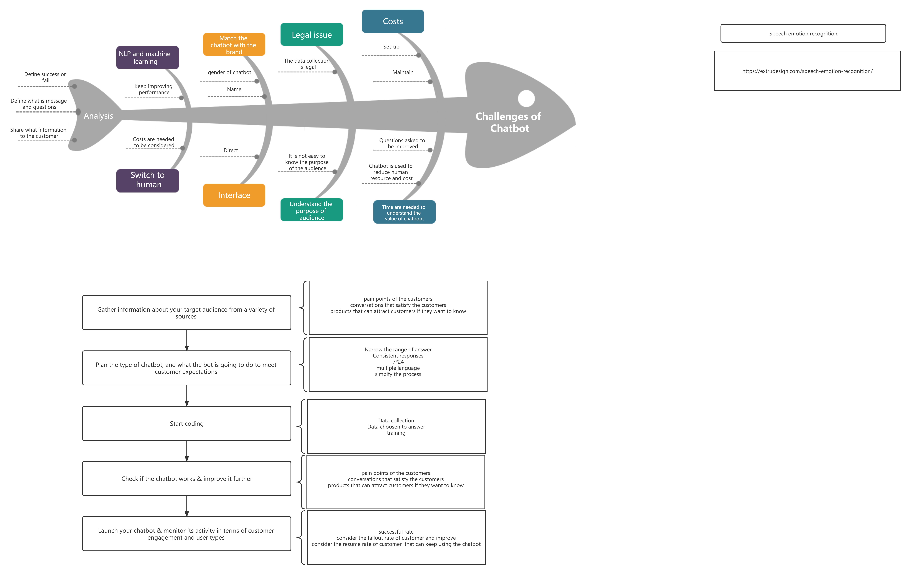

# Meeting Minutes 4
20.06.2022, 8:30M-10PM

Attendance
- Vivien Xian
- Zhaocheng Li
- Zhiqing Cen
- Harshwardhan Kothari
- Jinlei Ru

## Traffic sign recognition
- Harshwardhan Kothari
    - How to traffic:
      - https://www.diva-portal.org/smash/get/diva2:1575390/FULLTEXT02
        - https://www.researchgate.net/publication/342920804_Traffic_Sign_Recognition_with_Neural_Networks_in_the_Frequency_Domain
        - https://towardsdatascience.com/traffic-sign-recognition-using-deep-neural-networks-6abdb51d8b70
    - Difficulty:
        - https://www.researchgate.net/publication/342987130_Difficulties_of_Traffic_Sign_Recognition
        - Classification in challenging situations:  https://www.researchgate.net/publication/329999718_Traffic-Sign_Detection_and_Classification_Under_Challenging_Conditions_A_Deep_Neural_Network_Based_Approach

---

## Developing a chatbot for FAQs
Vivien Xian
- type1: data are pre-defined FAQs pairs, no tag involved.
    - https://www.jpmorgan.com/technology/technology-blog/faq-bot
    - https://github.com/UKPLab/sentence-transformers
    - libraries used:
        - BERT(Bidirectional Encoder Representations from Transformers)
- type2: training data are (sentence/question as input, intention tag as label); also need an additional dictionary that store pre-defined (tag, set of responses) pairs.
    - https://www.python-engineer.com/posts/chatbot-pytorch/
    - YouTube: https://www.youtube.com/playlist?list=PLqnslRFeH2UrFW4AUgn-eY37qOAWQpJyg
    - corresponding github: https://github.com/python-engineer/pytorch-chatbot?ref=morioh.com&utm_source=morioh.com
    - another similar resource in github: https://github.com/UsmanNiazi/Chatbot-with-Pytorch
    - libraries used:
        - nltk - NLTK (Natural Language Toolkit) is a leading platform for building Python programs to work with human language data. https://www.nltk.org/?ref=morioh.com&utm_source=morioh.com
        - https://medium.com/geekculture/simple-chatbot-using-bert-and-pytorch-part-1-2735643e0baa
    - libraries used:
        - Transformers - BERT is a transformer-based machine learning technique for natural language processing pre-training developed by Google.
- type3:
    - https://pytorch.org/tutorials/beginner/chatbot_tutorial.html
    - libraries used are just standard ones. training data are pairs of sentences extracted from movie dialogues, no intention tag involved, (i.e. seq2seq). the trained chatbot doesn't seem to function well.
    - https://github.com/jinfagang/pytorch_chatbot
    - seq2seq, similar to the one above.
    - https://medium.com/@tomgrek/from-first-principles-make-an-ai-customer-service-bot-in-pytorch-d1f4c9575d35
        - no other library involved. input of one data item is just single sentence, it works somewhat like sentence autocomplete
    - datasets (not specific):
        - https://www.kaggle.com/datasets/abbbhishekkk/faq-datasets-for-chatbot-training/version/4
        - Question and Answers pairs which can work as Training Data
        - https://analyticsindiamag.com/10-question-answering-datasets-to-build-robust-chatbot-systems/
        - https://hackernoon.com/top-15-chatbot-datasets-for-nlp-projects-8k2f3zqc
        - https://kili-technology.com/blog/36-best-machine-learning-datasets-for-chatbot-training
- comment:
    - many source are designed for open domain chatbot, while our FAQ chatbot is more like domain specific. we need appropriate dataset and code suitable for it. it's not easy to find such resource as we are required to have a large enough dataset (>1000)
    - https://teams.microsoft.com/l/message/19:M3LGMKI18lTurfIv4wPG7-h4jyO8yjXBt9YiR4vQxHA1@thread.tacv2/1655722453951?tenantId=3ff6cfa4-e715-48db-b8e1-0867b9f9fba3&amp;groupId=9a72d8f1-ce22-4f0c-bc73-97c57f428b54&amp;parentMessageId=1655721356475&amp;teamName=9444 project&amp;channelName=General&amp;createdTime=1655722453951

Jinlei Ru

## Speech emotion recognition
Zhiqing Cen
- Resources
    - [Speech Emotion Analyzer Github](https://github.com/MITESHPUTHRANNEU/Speech-Emotion-Analyzer)
    - [Speech Emotion Recognition ScienceDirect](https://www.sciencedirect.com/topics/computer-science/speech-emotion-recognition)
    - [Speech Emotion Recognition Kaggle](https://datasetsearch.research.google.com/search?src=2&query=Speech%20Emotion%20Recognition%20Dataset&docid=L2cvMTFxdDMwNHF6cQ%3D%3D)
    - [Speech Emotion Recognition (en)](https://www.kaggle.com/datasets/dmitrybabko/speech-emotion-recognition-en)
    - [PyTorch Audio tutorial](https://pytorch.org/tutorials/beginner/audio_io_tutorial.html)
- Steps
    - load audio file into waveform
    - chart
        - waveplot
        - spectrogram
- Library
    - [Librosa library](https://librosa.org/doc/main/install.html)
        - get waveform and sampling rate of audio file - `librosa.load`
        ~~~Python
        # Beat tracking example
        import librosa

        # 1. Get the file path to an included audio example
        filename = librosa.example('nutcracker')

        # 2. Load the audio as a waveform `y`
        #    Store the sampling rate as `sr`
        y, sr = librosa.load(filename)

        # 3. Run the default beat tracker
        tempo, beat_frames = librosa.beat.beat_track(y=y, sr=sr)

        print('Estimated tempo: {:.2f} beats per minute'.format(tempo))

        # 4. Convert the frame indices of beat events into timestamps
        beat_times = librosa.frames_to_time(beat_frames, sr=sr)
        ~~~
    - [matplotlib library installation](https://matplotlib.org/stable/users/installing/index.html)
        - matplotlib.pyplot
        - use together with librosa to plot waveplot and spectrogram
        ~~~Python
        # example
        def plot_waveplot(data, sr, e):
            plt.figure(figsize=(10, 3))
            plt.title('Waveplot for {} emotion'.format(e), size=15)
            librosa.display.waveplot(data, sr=sr)
            plt.show()

        def plot_spectrogram(data, sr, e):
            X = librosa.stft(data)
            Xdb = librosa.amplitude_to_db(abs(X))
            plt.figure(figsize=(12, 3))
            plt.title('Spectrogram for {} emotion'.format(e), size=15)
            librosa.display.specshow(Xdb, sr=sr, x_axis='time', y_axis='hz')   
            plt.colorbar()
        ~~~
- challenge
    - convert sound tract to analysable data
    - distractor noice (background noice)
    - more than one person speaking at the same time???
    - soft or load voice
    - switching emotion in one recording
- Output Range
    - 0 - female_angry
    - 1 - female_calm
    - 2 - female_fearful
    - 3 - female_happy
    - 4 - female_sad
    - 5 - male_angry
    - 6 - male_calm
    - 7 - male_fearful
    - 8 - male_happy
    - 9 - male_sad

## To-do
- [ ] more research on Traffic sign recognition - **Barry**
    - [ ] research (scholar articles & github resources)
    - [ ] datasets
    - [ ] challenges - **Harshwardhan**
    - [ ] how to implement - **Harshwardhan**
- [ ] more research on develop chatbot for FAQs - **Vivien**
    - [ ] research (scholar articles & github resources)
    - [ ] datasets
    - [ ] challenges - **Jinlei**
    - [ ] how to implement - **Jinlei**
- [ ] more research on Speech emotion recogintion - **Zhiqing**
    - [ ] research (scholar articles & github resources)
    - [ ] datasets
    - [ ] challenges - **Harshwardhan**
    - [ ] how to implement - **Jinlei**
    - think of it like we are doing a startup
