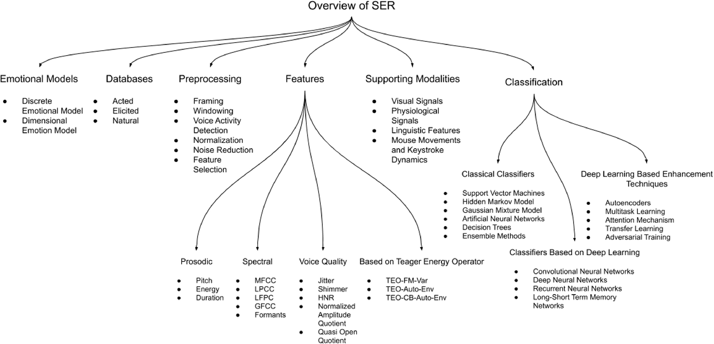
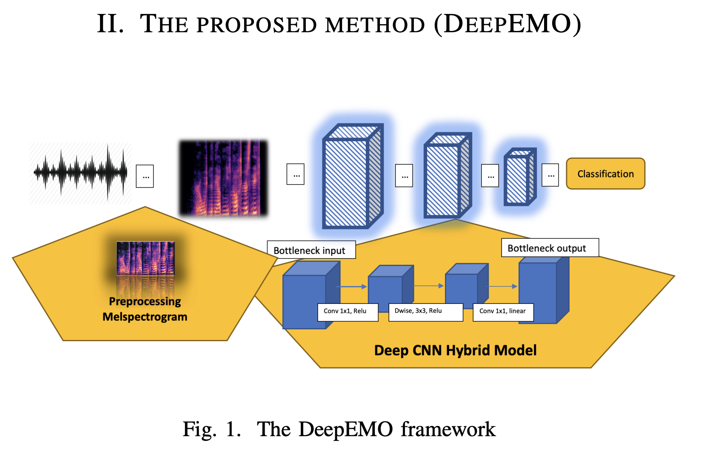
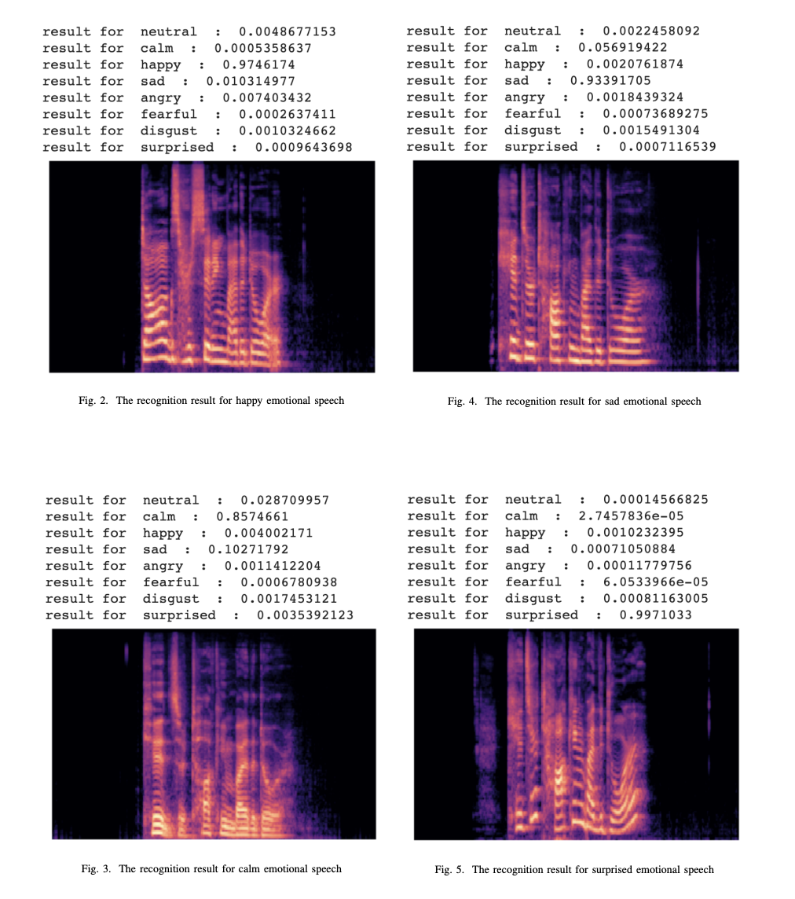
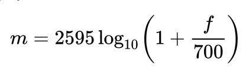
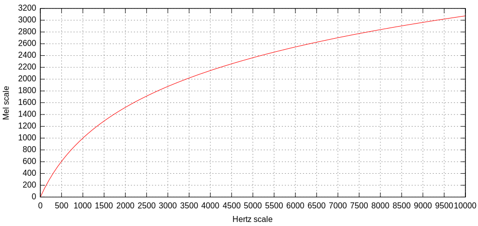

# Meeting Minutes 6
08.07.2022, 9:30PM-10:30PM

Attendance
- Vivien Xian
- Zhaocheng Li
- Zhiqing Cen
- Harshwardhan Kothari
- Jinlei Ru

## Notes
- choose speech emotion recognition rather than face recognition

### Zhaocheng Li
- [Report of MTLFace.pdf](../images/Report_of_MTLFace.pdf)
- [paper.pdf](../images/paper.pdf)
- [MTLFace](https://github.com/Hzzone/MTLFace)

### Harshwardhan Kothari
- [a.pdf](../images/a.pdf)
- [Face Mask Detection System Demo](https://www.youtube.com/watch?v=wYwW7gAYyxw)

### Jinlei Ru

- [3-D Convolutional Recurrent Neural Networks with Attention Model for Speech Emotion Recognition](../images/SER.pdf)
- limitations
    - use TensorFlow, which can't be used now
    - low accuracy: might recognise happy as angry and happy as neutral by mistake

### Vivien Xian
- [SER speech emotion recognition.pdf](../images/SER_speech_emotion_recognition.pdf)
- [Audio-and-text-based-emotion-recognition](https://github.com/aris-ai/Audio-and-text-based-emotion-recognition)
- [elderly-emotion-SC](https://github.com/gizemsogancioglu/elderly-emotion-SC)
- [The Interactive Emotional Dyadic Motion Capture (IEMOCAP) Database](https://sail.usc.edu/iemocap/)

### Zhiqing Cen

| publication    | database   | preprocessing    | features   | supporting modalities    | classification     |emotional model     |
| :------------- | :------------- | :------------- | :------------- | :------------- | :------------- |:------------- |
| [A review on emotion recognition using speech](https://ieeexplore.ieee.org/abstract/document/7975169?casa_token=23ZEHggA2-MAAAAA:fqoqWvvb_itIwz9aV6r_LLlSrfax73hRxKC1YIcOpYY5fzRQJs9T7gH1N6RlepxuPr42iMDxZw) (Basu et al., 2017)	  | ✔️  |only noise reduction or normalization   | ✔️  |✖️   |✔️   | ✖️  |
|[Emotion detection from text and speech: a survey](https://link.springer.com/article/10.1007/s13278-018-0505-2) (Sailunaz et al., 2018)   |✔️   | ✖️  | ✔️  | only textual features  |  ✔️ | ✔️  |
|[Speech emotion recognition: Emotional models, databases, features, preprocessing methods, supporting modalities, and classifiers](https://primoa.library.unsw.edu.au/primo-explore/openurl?sid=google&auinit=MB&aulast=Ak%C3%A7ay&atitle=Speech%20emotion%20recognition:%20Emotional%20models,%20databases,%20features,%20preprocessing%20methods,%20supporting%20modalities,%20and%20classifiers&id=doi:10.1016%2Fj.specom.2019.12.001&title=Speech%20communications%20:&volume=116&date=2020&spage=56&issn=0167-6393&vid=UNSW_SERVICES_PAGE&institution=61UNSW_INST&url_ctx_val=&url_ctx_fmt=null&isSerivcesPage=true) (Akçay et al.,2020)   |✔️   |✔️   |✔️   |✔️   |  ✔️ |  ✔️ |
|[DeepEMO: Deep Learning for Speech Emotion Recognition](https://arxiv.org/abs/2109.04081) (Togootogtokh et al., 2021)   |   |   |   |   |   |   |

#### article 1
[Speech emotion recognition: Emotional models, databases, features, preprocessing methods, supporting modalities, and classifiers](https://primoa.library.unsw.edu.au/primo-explore/openurl?sid=google&auinit=MB&aulast=Ak%C3%A7ay&atitle=Speech%20emotion%20recognition:%20Emotional%20models,%20databases,%20features,%20preprocessing%20methods,%20supporting%20modalities,%20and%20classifiers&id=doi:10.1016%2Fj.specom.2019.12.001&title=Speech%20communications%20:&volume=116&date=2020&spage=56&issn=0167-6393&vid=UNSW_SERVICES_PAGE&institution=61UNSW_INST&url_ctx_val=&url_ctx_fmt=null&isSerivcesPage=true)
- included a list of limitations of current publication in Speech Emotion Recognition
- limitations
    - can further be improved by adding features from other modalities, such as the ones that depend on visual or linguistic features

#### article 2
[DeepEMO: Deep Learning for Speech Emotion Recognition](https://arxiv.org/abs/2109.04081)

- DeepEMO model
- pipeline1 - preprocessing feature extraction, extract melspectrogram audio feature to train machine with high accuracy
    - compute fast Fourier transform (FFT)
        - decomposes a signal into it’s individual frequencies and the frequency’s amplitude, converts the signal from the time domain into the frequency domain
    - generate mel scale
        - converts frequencies to the mel scale
        - mel scale - a perceptual scale of pitches judged by listeners to be equal in distance from one another
        - The reference point between this scale and normal frequency measurement is defined by assigning a perceptual pitch of `1000 mels` to a `1000 Hz` tone, `40 dB` above the listener's threshold. Above about `500 Hz`, increasingly large intervals are judged by listeners to produce equal pitch increments
        - formula to convert `f` hertz into `m` mels is:
            

        

    - generate spectrogram
        - short-time Fourier transform -  compute several spectrums by performing FFT on several windowed segments
        - spectrum - computed FFT on overlapping windowed segments of the signal
- pipeline2 - deep transfer learning
    - prepare the pre-trained model
    - re-define the last output layer as n (in case, n=8) neurons layer for the new task
    - train the network
- use PyTorch
    ~~~python
    # PyTorch psudocode
    import torch
    import torch.nn as nn
    import torchvision

    model = torchvision.models.resnet18(pretrained = True)
    loss = torch.nn.CrossEntropyLoss()
    model.fc = torch.nn.Linear(inf eatures = 512, outf eatures = 8)
    optimizer = torch.optim.Adam(model.parameters(), lr = 3e − 5)
    ~~~

- dataset
    - [Ryerson Audio-Visual Database of Emotional Speech and Song (RAVDESS)](https://zenodo.org/record/1188976#.YsjoBi8RpQI)
- limitations

#### article 3
[A review on emotion recognition using speech](https://ieeexplore.ieee.org/abstract/document/7975169?casa_token=23ZEHggA2-MAAAAA:fqoqWvvb_itIwz9aV6r_LLlSrfax73hRxKC1YIcOpYY5fzRQJs9T7gH1N6RlepxuPr42iMDxZw)
- limitations

#### article 4
[Emotion detection from text and speech: a survey](https://link.springer.com/article/10.1007/s13278-018-0505-2)
- limitations
    - difficult to extract exact emotion from text (not what we are interested in)

## To-do
